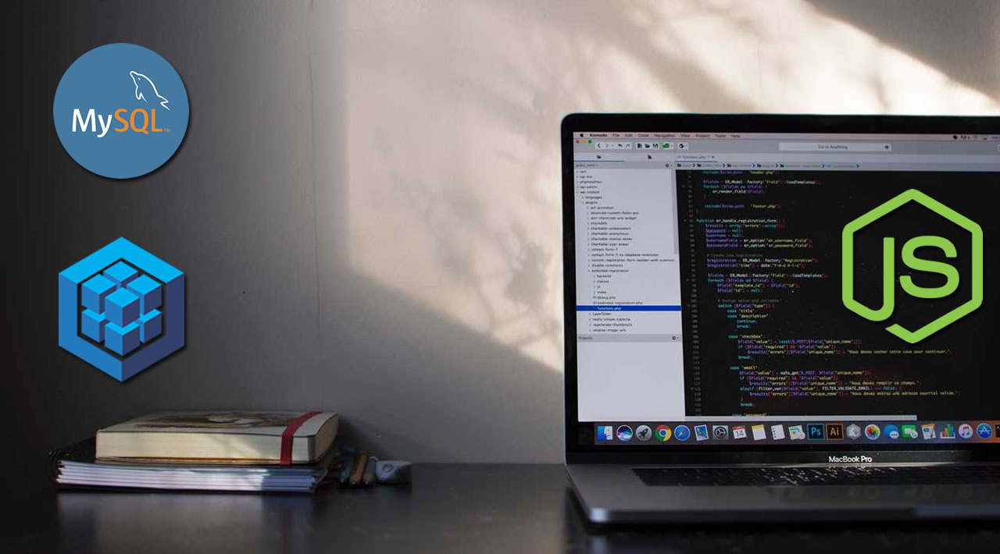

# nodejs-boilerplate

## Getting Started

```shell
git clone https://github.com/supundharmasiri/nodejs-boilerplate.git
cd nodejs-boilerplate

# Create environment variables from example
mv .env.example .env

# Install all dependencies
yarn

# Run on port 4000
yarn start
```

## Create SQL database migrations

```shell
npx sequelize migration:create --name migration-name
```

## Run SQL database migrations

```shell
yarn migrate
```

## Create SQL database seeders

```shell
npx sequelize seed:create --name seed-name
```

## Run SQL database seeders

```shell
yarn seed:all
```

## Run test

```shell
yarn test

# test live
yarn test:live
```

## Structure

```
.
├── app                         # App
│   ├── controllers             # App controllers
│   └── routes                  # App routes
├── config                      # App configuration files
│   └── sequelize.js            # sequelize config
├── sequelize                   # Sequelize helpers
│   ├── migrations              # Migrations
│   ├── models                  # Models
│   ├── seeders                 # Seeders
│   └── sequelize.js            # Sequelize mysql instantiation
├── helpers                     # Helpers
│   ├── common.js               # Common functions
│   ├── errorHandler.js         # errorHandler
│   └── validator.js            # Joi validator
├── middlewares                 # middlewares
│   ├── logger.js               # logger
│   ├── swaggerDefinitions.js   # Swagger definitions
│   └── swaggerMiddleware.js    # Swagger middleware
├── tests                       # Testing
├── .env                        # Environment variables
├── .sequelizerc                # Sequelize CLI config
├── index.js                    # App starting point
├── package.json
└── README.md         
```